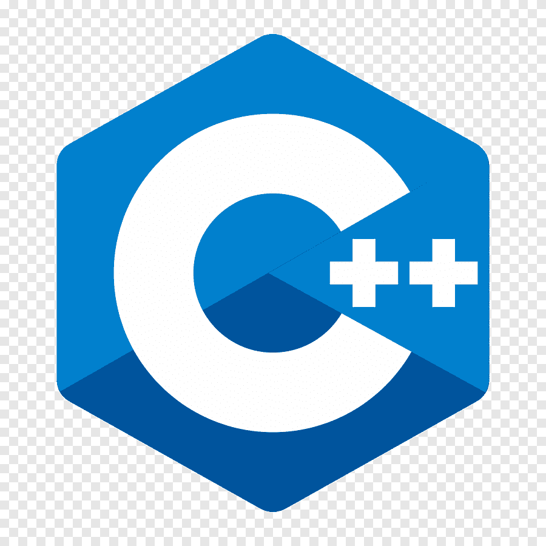
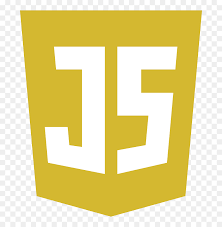
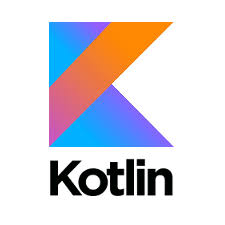
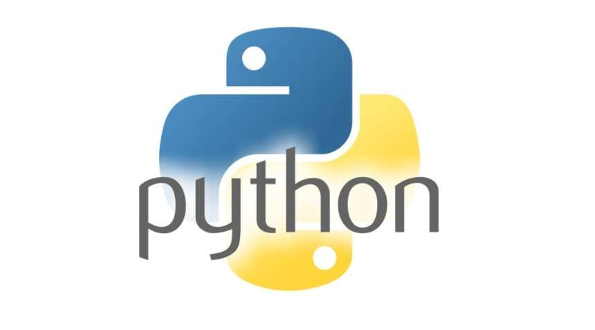

# Memory Matrix 🧠

A browser-based memory card game built with vanilla HTML, CSS, and JavaScript. Flip cards to find matching programming language logo pairs — all 8 matched and you win.

---

## Preview


---

## Features

- 4×4 grid with 8 unique programming language pairs
- Live move counter, timer, and matched pairs tracker
- Card flip animations with 3D CSS transforms
- Particle burst effect on every successful match
- Shake animation on mismatched pairs
- Hint button — briefly reveals all unmatched cards
- Win screen with confetti and your final score
- Fully shuffled board on every new game

---

## Tech Stack

- HTML5
- CSS3 (custom properties, 3D transforms, keyframe animations)
- Vanilla JavaScript (ES6+)

No frameworks. No dependencies. No build step.

---

## Project Structure

```
memory-matrix/
├── mainGame.html       # Main game file (all CSS & JS embedded)
├── index.js            # Standalone JS (legacy, not used in enhanced version)
├── style.css           # Standalone CSS (legacy, not used in enhanced version)
├── images/
│   ├── back.jpg        # Card back face
│   ├── c++.png
│   ├── css.png
│   ├── html.png
│   ├── java.jpg
│   ├── javascript.png
│   ├── kotlin.jpg
│   ├── php.png
│   └── python.jpg
└── screenshots/
    ├── matched.png
    ├── not_matched.png
    └── back_to_original.png
```

---

## Getting Started

1. Clone the repository

```bash
git clone https://github.com/your-username/memory-matrix.git
```

2. Move into the project folder

```bash
cd memory-matrix
```

3. Open `mainGame.html` in any modern browser

```bash
# macOS
open mainGame.html

# Windows
start mainGame.html

# Linux
xdg-open mainGame.html
```

No server required — the game runs entirely in the browser.

---

## How to Play

1. Click any card to flip it over
2. Click a second card to find its match
3. If both cards show the same logo — they stay revealed
4. If they don't match — they flip back after a short pause
5. Match all 8 pairs to win
6. Use the **Hint** button once to peek at all hidden cards for 0.8 seconds
7. Click **New Game** at any time to reset and reshuffle

---

## Card Pairs

| Logo | Language |
|------|----------|
|  | C++ |
|  | CSS |
|  | HTML5 |
|  | Java |
|  | JavaScript |
|  | Kotlin |
|  | PHP |
|  | Python |

---

## Browser Support

| Browser | Supported |
|---------|-----------|
| Chrome 90+ | ✅ |
| Firefox 88+ | ✅ |
| Safari 14+ | ✅ |
| Edge 90+ | ✅ |

---

## Adding More Cards

To add a new card pair, open `mainGame.html` and find the `CARDS` array near the top of the `<script>` block:

```javascript
const CARDS = [
    { id: 'cpp',  label: 'C++',  src: './images/c++.png',  alt: 'C++' },
    // ...
];
```

Add a new entry following the same format:

```javascript
{ id: 'rust', label: 'Rust', src: './images/rust.png', alt: 'Rust' },
```

Then place the image in the `images/` folder. The board will automatically expand — update the grid columns in CSS if you go beyond 8 pairs.

---

## License

MIT — free to use, modify, and distribute.
